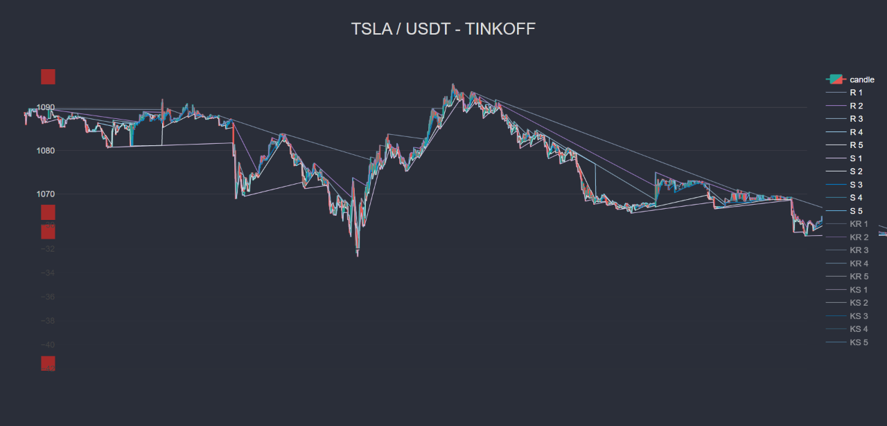

# Trend Lines indicator

Trendlines are a key part of delving into technical analysis and trading off of charts. When used correctly, they're a helpful, clear, and relatively simple tool for traders.

## Sample result




## Description

The search for support and resistance lines is carried out by squeezing to the center of the price movement.
The indicator returns an array of values of five support lines, resistance lines and their slope coefficients. The slope coefficients data provided for demonstration purposes.
The parameters are accepted:
* maxForks = 10 - limit number of branches
* slidingMethod - sliding method.
  * 0 - non-sliding Trend Line (Zero element of the output array shows the outer support or resistance line),
  * 1 - moving Trend Line (Zero element of the array is closer (inner line) to the current price)
* minLog, maxLog - the range of candlestick log data output

To display the slope data closer to the candlestick data on the chart, normalization is used
```javascript
        let scale = {
            y: 1000,    // Shift
            k: 20       // Multuplicator
        }
```

## Authors
* [Dmitry Korotkov](https://github.com/inimatic)
* [Dmitry Yurov](https://github.com/BusinessDuck)

