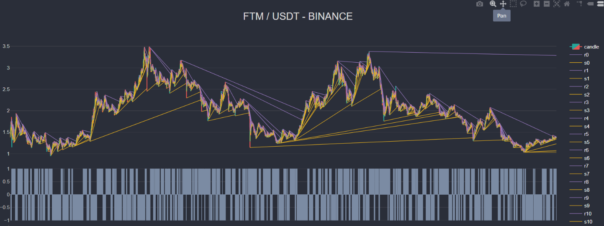

# Trend Lines indicator

## Description

Trendlines are a key part of delving into technical analysis and trading off of charts. When used correctly, they're a helpful, clear, and relatively simple tool for traders.
There are many approaches to construct [trending lines](https://ru.tradingview.com/script/eXUYLaGv-Trend-Lines-v2/). All of them are based on building lines through extremes. There are some unavoidable issues of this method. First is uncertainty of any kind approximation. Second, large and expanding data array of extremes required to construct future lines.
Here we propose new and much more effective method for the trading lines discovery. This method based on three actions: change incline, fork, and break.

## Method

The search for support and resistance lines is carried out by squeezing to the center of the price movement. We search simultaneously support and resistance lines. Here and after we describe resistance line. Similar procedure provided on the support lines.

-   We begin from historical data. First line is drawn through the high point of the two candles.
-   If the next h-value is higher the line then we change incline of the line.
-   If the next h-value is lower the line then we fork: create new line from the current point with the same behavior.
-   If incline become > 0 then next fork will replace current.
-   If current line is crossing upper line then we delete it.

This method doesn’t require keeping historical candles data for future calculations. We keep only 1 candle back in the history and metadata of non deleted lines (up to 60 lines).

## Sample result





```
> @debut/strategies@1.0.0 testing
> tester -- "--bot=ExpBot" "--ticker=FTMUSDT" "--days=200"

History loading from [binance] 07.09.2021:

 [████████████████████████████████████████] 100% | 200 of 200 days

---- [binance] [FTMUSDT] ----

Tested in 9845 candles...
Report data is ready...
{
  startBalance: 600,
  balance: 3018.46,
  maxBalance: 3227.26,
  minBalance: 600,
  maxMarginUsage: 600,
  profit: 2418.46,
  long: 148,
  longRight: 65,
  short: 148,
  shortRight: 75,
  absoluteDD: 6.68,
  relativeDD: 14.38,
  maxWin: 52.91,
  maxLoose: -10.55,
  profitProb: 0.47,
  looseProb: 0.53,
  avgProfit: 35.76,
  avgLoose: 16.59,
  expectation: 8.17,
  failLine: 6,
  rightLine: 7,
  avgFailLine: 1.97,
  avgRightLine: 1.76,
  ticksHandled: 9845,
  candlesHandled: 9644
}
```
## Authors

-   [Dmitry Korotkov](https://github.com/inimatic)
-   [Dmitry Yurov](https://github.com/BusinessDuck)
